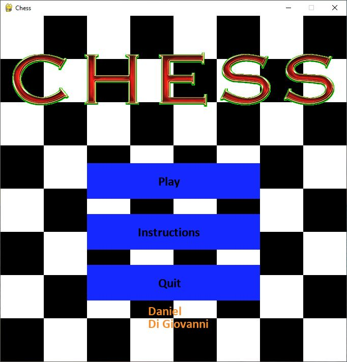
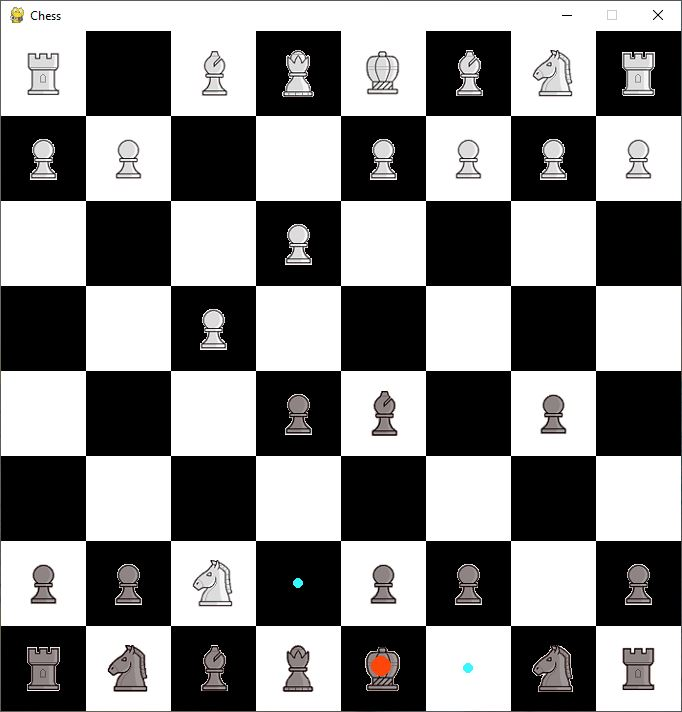
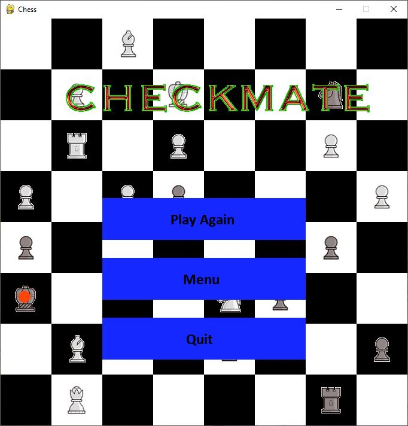

Introduction
============

This is chess made in Python with the Pygame library.
This was made in 2019.

Requirements
============

This module requires the `pygame` library and at least Python 2.7.

Installation
============

Fork this repository, and run `chess.py` with a Python interpreter.
The interpreter must be at least version 2.7 and must have the `pygame` library installed.

Contact
=======

Daniel Di Giovanni - <dannyjdigio@gmail.com>
